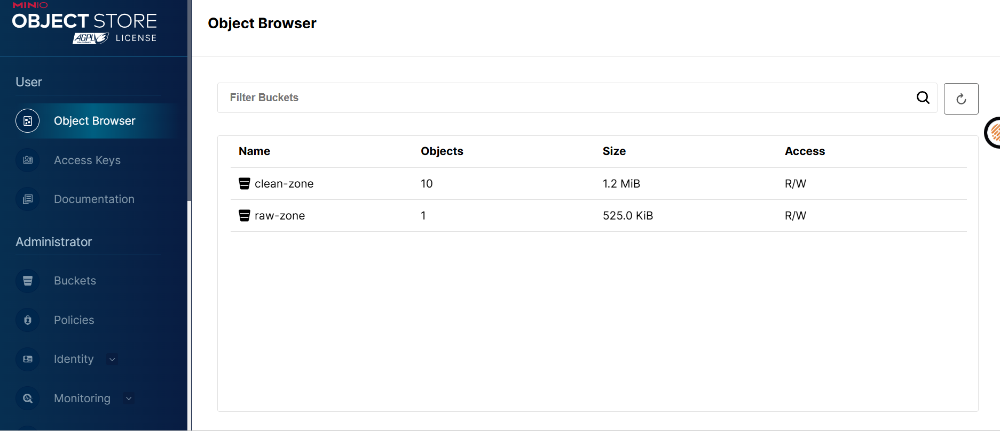
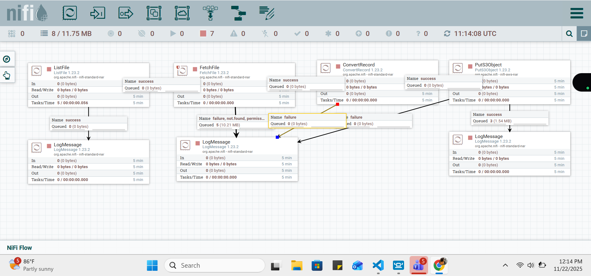

# 📘 ETL Pipeline Documentation
## Apache NiFi → MinIO → Apache Spark (Dockerized)

A fully containerized ETL pipeline demonstrating production-grade data engineering practices with clean separation of concerns across ingestion, storage, and processing layers.

---

## 📑 Table of Contents

1. [Overview](#overview)
2. [Architecture](#architecture)
3. [Prerequisites](#prerequisites)
4. [Quick Start](#quick-start)
5. [Detailed Setup Guide](#detailed-setup-guide)
6. [NiFi Configuration](#nifi-configuration)
7. [Spark Processing](#spark-processing)
8. [Project Structure](#project-structure)
9. [Troubleshooting](#troubleshooting)

---

## 🎯 Overview

This project implements a complete ETL pipeline that:
- Ingests CSV files using Apache NiFi
- Converts CSV to Parquet format
- Stores data in MinIO (S3-compatible object storage)
- Processes and transforms data using Apache Spark

**Data Flow:**
```
CSV Files → NiFi → MinIO (raw-zone/) → Spark → MinIO (clean-zone/)
```

### Technology Stack

| Component | Purpose | Why Chosen |
|-----------|---------|------------|
| **Apache NiFi** | Data ingestion & transformation | Visual development, automatic file detection, provenance tracking, S3 compatibility |
| **MinIO** | Object storage (Data Lake) | S3-compatible, runs locally, ideal for data lake patterns |
| **Apache Spark** | Data processing & ETL | Large-scale capability, Parquet optimization, distributed processing |
| **Parquet** | Storage format | Columnar storage, highly compressed, schema-aware, analytics-optimized |
| **Docker** | Containerization | Reproducible environment, easy deployment |

### Dataset

The pipeline processes **transactional credit-risk data** containing:
- Demographics: Age, Gender, Marital Status
- Financial Metrics: Income, Assets, Credit Score
- Loan Attributes: Amount, Purpose, Employment Status
- Behavior: Payment History, Defaults, Risk Rating

---

## 🏗️ Architecture

```
┌─────────────┐      ┌──────────┐      ┌─────────────┐
│   CSV Files │ ───► │  Apache  │ ───► │    MinIO    │
│  (./data/)  │      │   NiFi   │      │ (raw-zone)  │
└─────────────┘      └──────────┘      └─────────────┘
                                               │
                                               ▼
                                        ┌─────────────┐
                                        │   Apache    │
                                        │   Spark     │
                                        └─────────────┘
                                               │
                                               ▼
                                        ┌─────────────┐
                                        │    MinIO    │
                                        │(clean-zone) │
                                        └─────────────┘
```

**Component Responsibilities:**
- **NiFi**: File detection, format conversion, data ingestion
- **MinIO**: Persistent object storage with bucket organization
- **Spark**: Data cleaning, normalization, transformation

---

## ✅ Prerequisites

Before starting, ensure you have:

- **Docker Desktop** (or Docker Engine)
- **Docker Compose** v2.0+
- **Minimum 4GB RAM** allocated to Docker
- **10GB free disk space** (for images and data)
- **Stable internet connection** (for downloading images and JARs)

**Verify installations:**
```bash
docker --version
docker compose version
```

---

## 🚀 Quick Start

### Step 1: Clone Repository
```bash
git clone https://github.com/crypticwisdom/nifi-minio-spark-etl.git
cd nifi-minio-spark-etl
```

### Step 2: Build & Start Services
```bash
docker compose build
docker compose up -d
```

⏱️ **Expected Build Time:** 25-30 minutes (first time only)

### Step 3: Verify Services
```bash
docker compose ps
```

All services should show status as `Up`.

### Step 4: Access Web Interfaces

| Service | URL | Credentials |
|---------|-----|-------------|
| **NiFi UI** | http://localhost:8443 | - |
| **Spark Master** | http://localhost:8080 | - |
| **MinIO Console** | http://localhost:9010 | minioadmin / minioadmin |

---

## 📋 Detailed Setup Guide

### 1. MinIO Configuration

**Access MinIO Console:** http://localhost:9010

**Login credentials:**
```
Username: minioadmin
Password: minioadmin
```

**Create Required Buckets:**

1. Click **"Buckets"** in left sidebar
2. Click **"Create Bucket"**
3. Create bucket: `raw-zone`
4. Click **"Create Bucket"** again
5. Create bucket: `clean-zone`



**Bucket Purpose:**
- `raw-zone`: Stores Parquet files from NiFi ingestion
- `clean-zone`: Stores processed data from Spark jobs

### 2. Add Sample Data

Place your CSV file in the input directory:

```bash
# Create input directory if it doesn't exist
mkdir -p data/input

# Copy your CSV file
cp your-data.csv data/input/
```

The `data/input` directory is mounted to NiFi and will be monitored automatically.

---

## ⚙️ NiFi Configuration

### Option A: Import Pre-configured Template (Recommended)

**Step 1: Access NiFi UI**
- Navigate to http://localhost:8443
- Wait for NiFi to fully initialize (may take 2-3 minutes)


**Step 2: Upload Template**
1. Right-click on the canvas
2. Select **"Upload Template"**
3. Click **"Select Template"**
4. Navigate to: `./CSV-Extraction_ingestion_Layer_.xml`
5. Click **"Upload"**

**Step 3: Add Template to Canvas**
1. Drag the **Template icon** (📄) from the top toolbar onto canvas
2. Select **"CSV-Extraction_ingestion_Layer"**
3. Click **"Add"**

**Step 4: Configure Controller Services**
1. Right-click on canvas → **"Configure"**
2. Go to **"Controller Services"** tab
3. Enable the following services (click ⚡ icon):
   - **CSVReader**
   - **ParquetRecordSetWriter**

**Step 5: Start the Flow**
1. Select all processors (Ctrl+A or Cmd+A)
2. Right-click → **"Start"**

### Option B: Manual Processor Configuration

If you prefer to build the flow manually:

#### 1️⃣ ListFile Processor

**Purpose:** Monitors directory for new CSV files

**Configuration:**
```
Scheduling:
  Run Schedule: 10 sec

Properties:
  Input Directory: /data/input
  File Filter: .*\.csv
  Recurse Subdirectories: false
  Minimum File Age: 0 sec
  Maximum File Age: (leave empty)
```

#### 2️⃣ FetchFile Processor

**Purpose:** Reads file content into FlowFile

**Configuration:**
```
Scheduling:
  Run Schedule: 0 sec (timer driven)

Properties:
  File to Fetch: ${absolute.path}/${filename}
  Completion Strategy: None
```

**Connection:**
- Connect `ListFile` → `FetchFile` (success relationship)

#### 3️⃣ ConvertRecord Processor

**Purpose:** Converts CSV to Parquet format

**Configuration:**
```
Scheduling:
  Run Schedule: 0 sec

Properties:
  Record Reader: CSVReader
  Record Writer: ParquetRecordSetWriter
```

**Controller Services Setup:**

**CSVReader:**
```
Schema Access Strategy: Infer Schema
Treat First Line as Header: true
CSV Format: Custom Format
Value Separator: ,
Skip Header Line: false
Quote Character: "
Escape Character: \
Comment Marker: (none)
Trim Fields: true
```

**ParquetRecordSetWriter:**
```
Schema Write Strategy: Embed Avro Schema
Schema Access Strategy: Inherit Record Schema
Compression Type: SNAPPY
```

**Enable Both Services:**
1. Click ⚡ icon next to each service
2. Click **"Enable"**

**Connection:**
- Connect `FetchFile` → `ConvertRecord` (success relationship)

#### 4️⃣ PutS3Object Processor

**Purpose:** Uploads Parquet to MinIO

**Configuration:**
```
Scheduling:
  Run Schedule: 0 sec

Properties:
  Bucket: raw-zone
  Object Key: ${filename}.parquet
  
  Region: us-east-1
  Endpoint Override URL: http://minio:9000
  
  Access Key ID: minioadmin
  Secret Access Key: minioadmin
  
  Signer Override: S3SignerType
  Use Path Style Access: true
```

**Connection:**
- Connect `ConvertRecord` → `PutS3Object` (success relationship)

#### Auto-terminate Relationships

For clean flow management, auto-terminate unused relationships:

**ConvertRecord:**
- Auto-terminate: failure

**PutS3Object:**
- Auto-terminate: failure, success


---

## ⚡ Spark Processing

### Method 1: Process Parquet from MinIO (Standard Pipeline)

After NiFi ingests data into `raw-zone`:

**Step 1: Enter Spark Container**
```bash
docker exec -it pyspark-client bash
```

**Step 2: Run Processing Script**
```bash
spark-submit --master spark://spark-master:7077 processor.py
```

**What This Does:**
- Reads Parquet files from MinIO (`s3a://raw-zone/`)
- Cleans and normalizes data
- Handles missing values
- Computes derived fields
- Writes output to MinIO (`s3a://clean-zone/`)

### Method 2: Process CSV Directly (Fallback Option)

Skip NiFi and process CSV directly with Spark:

**Step 1: Enter Spark Container**
```bash
docker exec -it pyspark-client bash
```

**Step 2: Run CSV Processing Script**
```bash
spark-submit --master spark://spark-master:7077 process-csv.py
```

**Use Case:** Ideal for testing or when NiFi configuration is problematic.

### Monitoring Spark Jobs

**Spark Master UI:** http://localhost:8080
- View active/completed applications
- Monitor worker status
- Check resource allocation

**Job Execution Logs:**
```bash
docker logs pyspark-client
```

---

## 📁 Project Structure

```
nifi-minio-spark-etl/
│
├── docker-compose.yml              # Service orchestration
├── Dockerfile                      # NiFi container configuration
├── CSV-Extraction_Ingestion_Layer_.xml  # NiFi template
│
├── spark-scripts/
│   ├── Dockerfile                  # Spark container configuration
│   ├── processor.py                # Processes Parquet from MinIO
│   └── process-csv.py              # Direct CSV processing (fallback)
│
├── data/
│   └── input/                      # Place CSV files here
│
├── nifi/
│   └── nifi_data/                  # NiFi persistent data
│
├── minio/
│   └── minio_data/                 # MinIO persistent storage
│
└── assets/
    ├── docker-build.png
    ├── buckets.png
    ├── nifi-screenshot.png
    └── ingested.png
```

---

## 🔍 Troubleshooting

### Common Issues

**Issue: NiFi UI not accessible**
```bash
# Check NiFi logs
docker logs nifi

# Wait for initialization (can take 2-3 minutes)
# Look for: "NiFi has started. The UI is available"
```

**Issue: MinIO buckets not visible**
```bash
# Restart MinIO container
docker compose restart minio

# Verify bucket creation
docker exec minio mc ls local/
```

**Issue: Spark job fails with S3A errors**
```bash
# Verify MinIO is accessible from Spark
docker exec pyspark-client curl http://minio:9000

# Check S3A configuration in processor.py
# Ensure credentials match MinIO (minioadmin/minioadmin)
```

**Issue: NiFi processors showing warnings**
```
# Common fix: Enable Controller Services
1. Right-click canvas → Configure
2. Controller Services tab
3. Enable CSVReader and ParquetRecordSetWriter
```

### Viewing Logs

```bash
# All services
docker compose logs -f

# Specific service
docker compose logs -f nifi
docker compose logs -f spark-master
docker compose logs -f minio

# Last 100 lines
docker compose logs --tail=100 nifi
```

### Resetting the Environment

```bash
# Stop all services
docker compose down

# Remove volumes (CAUTION: deletes all data)
docker compose down -v

# Rebuild and restart
docker compose build --no-cache
docker compose up -d
```

---

## 🎓 Learning Outcomes

This project demonstrates:

✅ **Production-grade ingestion patterns** with Apache NiFi  
✅ **S3-compatible data lake architecture** using MinIO  
✅ **Optimized analytics storage** with Parquet format  
✅ **Distributed data processing** with Apache Spark  
✅ **Containerized microservices** with Docker Compose  
✅ **Separation of concerns** in ETL design  
✅ **Real-world data engineering workflows**  

---

## 📝 Next Steps

After running the pipeline:

1. **Verify data in MinIO:**
   - Check `raw-zone` bucket for Parquet files
   - Check `clean-zone` bucket for processed data

2. **Explore Spark transformations:**
   - Modify `processor.py` for custom logic
   - Add new data quality checks
   - Implement additional aggregations

3. **Scale the pipeline:**
   - Add more Spark workers in `docker-compose.yml`
   - Process larger datasets
   - Implement partitioning strategies

---

## 📧 Support

For issues or questions:
- **GitHub Issues:** https://github.com/crypticwisdom/nifi-spark-minio-etl/issues
- **Documentation:** This README
- **Logs:** `docker compose logs [service-name]`

---

**Built with ❤️ for demonstrating modern data engineering**
