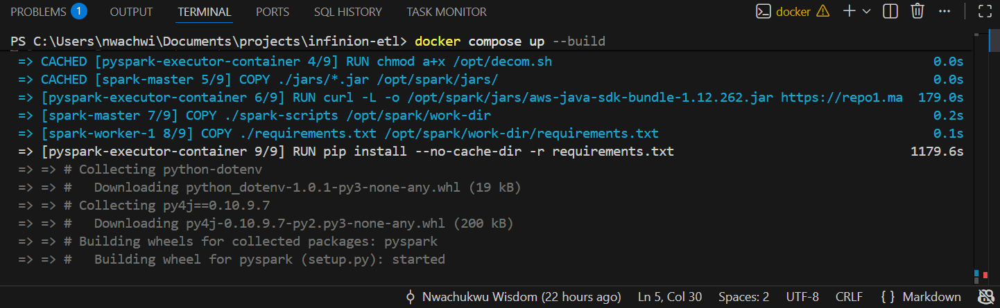

# 📘 **ETL Pipeline Documentation — Apache NiFi → MinIO → Apache Spark (Dockerized)**

This repository contains a fully containerized ETL pipeline that ingests CSV files, converts them to Parquet using Apache NiFi, stores them in MinIO (S3-compatible object store), and transforms them using Apache Spark.
It demonstrates a clean separation of concerns across **ingestion**, **storage**, and **processing** layers—aligned with real-world data engineering practices.

---

# 1️⃣ **Prerequisites**

Before running the project, ensure the following are installed on your system:

### ✔ Docker

### ✔ Docker Compose

### ✔ At least 4GB RAM allocated to Docker

### ✔ Stable internet (images + JARs downloaded during build)

---

# 2️⃣ **Architecture Overview**

| Component          | Purpose                                                                        |
| ------------------ | ------------------------------------------------------------------------------ |
| **Apache NiFi**    | Ingestion pipeline. Detects CSV files → Converts to Parquet → Uploads to MinIO |
| **MinIO**          | Object storage serving as the project’s Data Lake                              |
| **Apache Spark**   | Reads Parquet from MinIO → Cleans, normalizes, and transforms data             |
| **Docker Compose** | Orchestrates the entire environment                                            |

**High-level flow:**

```
CSV Files → NiFi → MinIO (raw-zone/) → Spark → MinIO (clean-zone/)
```

---

# 3️⃣ **Why These Technologies?**

### ⭐ **Apache NiFi**

Used because it's a production-grade ingestion tool:

* Visual development (drag-drop flows)
* Automatic file detection, retries, provenance tracking
* Lightweight transformations (CSV → Parquet)
* S3 compatibility via PutS3Object

This avoids tightly coupling ingestion with Spark, giving a more modular architecture.

### ⭐ **MinIO**

* S3-compatible object storage
* Easy to run locally
* Ideal for data lake patterns
* Works seamlessly with Spark using the S3A connector

### ⭐ **Apache Spark**

Chosen for:

* Large-scale ETL capability
* Built-in Parquet optimizations
* Efficient handling of semi-structured financial/transactional data
* Ability to run distributed jobs (even with 1-2 workers)

### ⭐ **Parquet Format**

Parquet is used instead of CSV because:

* Columnar (fast analytical reads)
* Highly compressed
* Schema-aware
* Ideal for Spark processing
* Smaller storage footprint in MinIO

---

# 4️⃣ **Dataset Summary (Transactional Credit-Risk Data)**

The CSV represents **loan applications and credit-risk attributes**, such as:

* Demographics (Age, Gender, Marital Status)
* Financial metrics (Income, Assets, Credit Score)
* Loan attributes (Amount, Purpose, Employment Status)
* Behavior (Payment History, Defaults)
* Risk Rating (Low/Medium/High)

Spark later cleans & normalizes these fields to make them analytics-ready.

---

# 5️⃣ **Set Up & Run the Environment**

## ► Step 1: Clone the Repository

```bash
git clone https://github.com/crypticwisdom/nifi-minio-spark-etl.git
cd nifi-minio-spark-etl
```

## ► Step 2: Build & Start All Services

```bash
docker compose build
docker compose up -d
```

## 📌 Build Time

The initial build (Spark image + JAR downloads) takes:

⏱ **~25–30 minutes**

---

# 6️⃣ **Accessing the Services**

| Service             | URL                                            |
| ------------------- | ---------------------------------------------- |
| **NiFi UI**         | [http://localhost:8443](http://localhost:8443) |
| **Spark Master UI** | [http://localhost:8080](http://localhost:8080) |
| **MinIO Console**   | [http://localhost:9001](http://localhost:9001) |

Default MinIO credentials:

```
User: minioadmin
Pass: minioadmin
```

---

# 7️⃣ **NiFi Ingestion Pipeline**

## 📌 NiFi Flow Design


```
ListFile → FetchFile → ConvertRecord → PutS3Object
```
## Screenshot of NIFI Processors


---

## 📘 **Processor Breakdown**

### ✔ ListFile

Scans `./data/input` (mounted to NiFi as `/data/input`) for new CSVs.

### ✔ FetchFile

Retrieves file content into FlowFile.

### ✔ ConvertRecord

* CSVReader → parses CSV
* ParquetRecordSetWriter → writes Parquet

### ✔ PutS3Object

Writes the Parquet file to MinIO bucket:

```
raw-zone/
```

---

## 📸 **Include your NiFi Screenshots here**

* Canvas view
* Processor configuration
* Successful flowfile provenance

---

## 📥 **Importing the NiFi Template (.xml)**

If recruiters want the ready-made workflow:

```
NiFi UI → Operate Palette/Right click → select "Upload Template" → Choose CSV-Extraction_ingestion_Layer_.xml from this directory → Add to Canvas
```

The template is located at:

```
nifi/templates/CSV-Extraction_ingestion_Layer_.xml
```

This ensures the ETL flow is reproducible across environments.

---

# 8️⃣ **Spark Processing**

You can process the data either:

### ✔ Through NiFi → Parquet → Spark
After NIFI ingest data into minio bucket 'raw-zone.

## ▶ Enter Spark client container

```bash
docker exec -it pyspark-client bash
```

## ▶ Run your Spark ETL job

```bash
spark-submit \
  --master spark://spark-master:7077 \
  processor.py
```

OR

### ✔ (Fallback Option) **Directly with Spark** if NiFi isn't available

---

## ▶ Enter Spark client container

```bash
docker exec -it pyspark-client bash
```

## ▶ Run your Spark ETL job

```bash
spark-submit \
  --master spark://spark-master:7077 \
  process-csv.py
```

---

## 📘 Spark Script (Summary of Logic)

Your Spark job performs:

* Reading Parquet files from MinIO using S3A
* Casting numeric columns properly
* Standardizing text fields (lowercase, trim)
* Handling missing values
* Computing derived fields (encoded risk, cleaned categories)
* Writing cleaned output to MinIO:

```
s3a://clean-zone/
```

---

# 9️⃣ **Project Structure**

```
project/
│
├── docker-compose.yml
├── Dockerfile
├── CSV-Extraction_Ingestion_Layer_.xml
├── spark-scripts/
│   ├── Dockerfile
│        └── processor.py   # Run this for processing store parquet on MINIO
│        └── process-csv.py # Run this to avoid the NIFI stress, and process csv data directly
│
├── nifi/
│   └── nifi_data/
│
├── data/
│   └── input/       # Drop CSV files here
│
└── minio/
    └── minio_data/
```

---

# 🔟 **Alternative Path (If NiFi Is Tedious to Configure)**

A fallback PySpark script (`process_csv.py`) is also included.

It:

* Reads raw CSV directly
* Cleans & transforms
* Writes Parquet directly to MinIO

Recruiters can run it without setting up NiFi:

```bash
spark-submit \
  --master spark://spark-master:7077 \
  process-csv.py
```

This ensures the project is **still fully testable even without NiFi running**.

---

# 1️⃣1️⃣ **Conclusion**

This project demonstrates:

* **Proper separation of ingestion → storage → transformation layers**
* Use of **NiFi** for production-like ingestion flows
* Use of **Parquet** for optimized analytics
* Integration of **Spark** with S3-compatible storage
* Containerized, self-contained environment suitable for local or demo deployments
* A clean, modular ETL implementation that mirrors real-world data engineering pipelines


